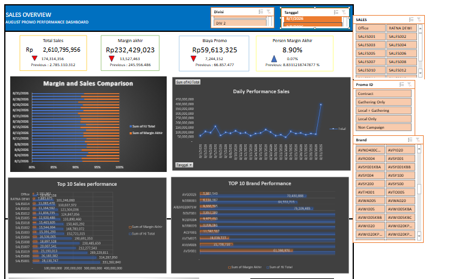
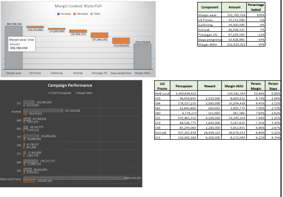

# promo-performance-analysis
A business intelligence case study analyzing promotional performance, sales, costs, and profitability to identify opportunities for sustainable growth.
# 📊 Promo Performance & Profitability Analysis

> A business intelligence case study analyzing whether promotional activities generate profitable growth—not just higher sales.

---

## 📌 Project Overview

Promotional programs are commonly used to increase sales performance and
achieve revenue targets. However, higher sales do not necessarily result
in higher profitability.

This project analyzes the relationship between sales performance,
promotional costs, and final margin through an interactive Promo
Performance Dashboard.

---

## 📷 Dashboard Preview

*Figure 1. Sales Overview – August Promo Performance Dashboard.*

---

## 🎯 Business Problem

How can the business evaluate whether promotional activities are
generating profitable growth rather than simply increasing sales?

...

---

## 📊 Margin & Campaign Analysis

*Figure 2. Margin erosion and campaign performance analysis.*

...
## 📁 Project Files

The Excel file used for this analysis is available in this repository.

📥 [Download the Excel Dashboard](data/Promo-Performance-Analysist%(1).xlsx)
